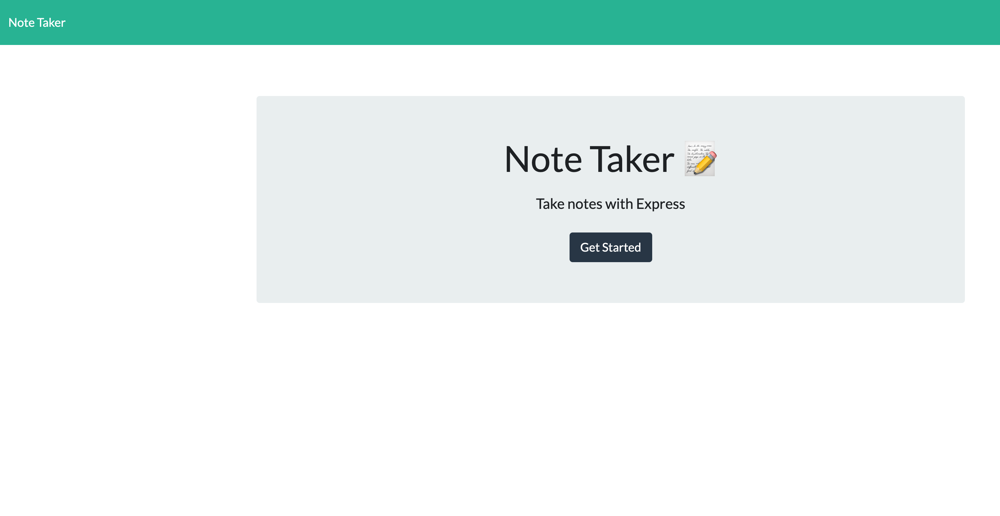
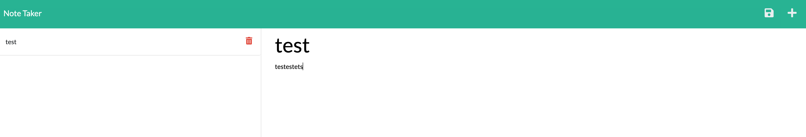

# Note Taker
 
## Description
This application allows user to create, save, edit and delete notes.

## Table of contents

* [Installation](#installation)
* [Usage](#usage)
* [License](#license)
* [Contributors](#contributors)

* [Questions](#questions)

## Installation
This application require Express.js to run and is deployed to heroku.
        

## Usage
This application can be used by directly using this link https://note-taker-ttm.herokuapp.com/ or by running npm start and using this link http://localhost:3001/. Once the application is open via browser, click on the get started to enter the notes webpage. once there, you can enter any title and body for your notes and a save button will appear on the top right hand side. once saved, file can be accessed on the left handside. if the delete button is click on the left hand side then the notes will be removed for the saved list. At any givent time you can create a new note by click on the plus sign on the top right hand corner.

Screenshots:
* homepage:
 

* notes:
 
        
## License
This application has the following licenses:
* [MIT License](https://choosealicense.com/licenses/mit/)

                    

## Contributors
Original source code: https://github.com/coding-boot-camp/miniature-eureka
        

## Questions
If you have any questions feel free to contact me using the following sources:  
GitHub: [tonymengt](https://github.com/tonymengt)  
Email: [tonymengt@gmail.com](mailto:tonymengt@gmail.com)
